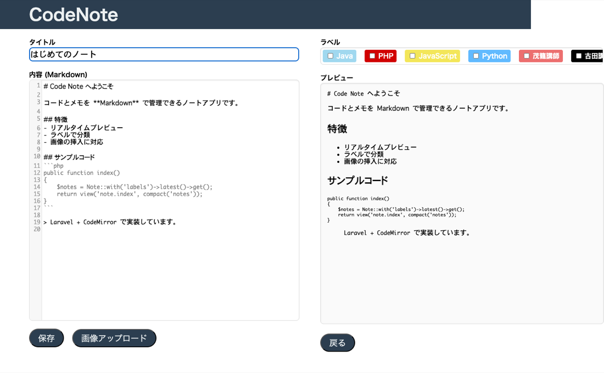
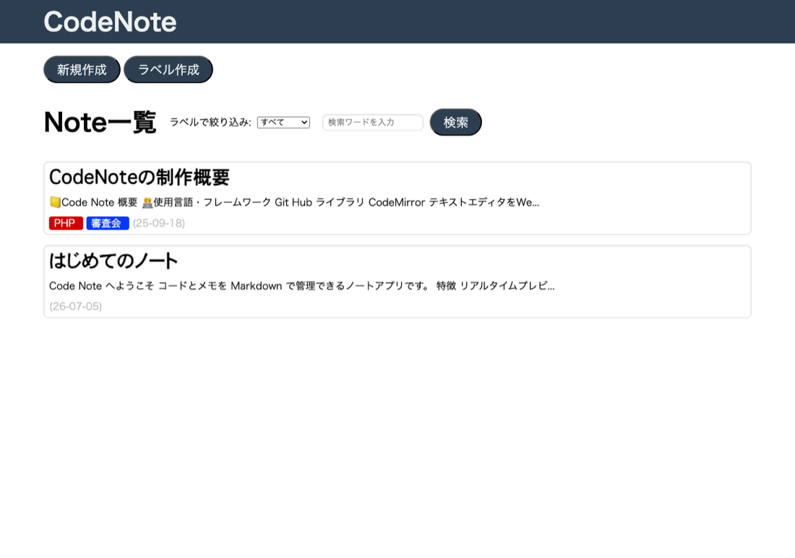

# 📒 Code Note

> コードやメモをMarkdown形式で整理・管理できる個人向けWebアプリケーション

---

## 📌 概要

エンジニアが自分のコードスニペットやメモを一元管理するためのWebアプリです。  
Markdownエディタを搭載し、リアルタイムプレビューで快適にノートを作成できます。  
ラベル機能でノートを分類・整理でき、画像の埋め込みにも対応しています。

---

## 📸 スクリーンショット

### Markdownエディタ（リアルタイムプレビュー）
左側のCodeMirrorエディタに入力した内容が、右側に即座にHTMLプレビューとして反映されます。ラベルの付与にも対応しています。

### ノート一覧
作成したノートを一覧表示。ラベルによる絞り込みやキーワード検索が可能です。

---

## 🛠️ 技術スタック

| カテゴリ | 使用技術 |
|---|---|
| バックエンド | PHP / Laravel |
| フロントエンド | HTML / CSS / JavaScript |
| データベース | MySQL |
| エディタ | CodeMirror（リッチテキストエディタ） |
| Markdown変換 | commonmark |

---

## ✨ 主な機能

- **ユーザー認証** ― 新規登録・ログイン・ログアウト
- **ノート管理** ― 作成・編集・削除（CRUD）
- **Markdownリアルタイムプレビュー** ― CodeMirrorによるコードハイライト付きエディタ
- **ラベル管理** ― ノートへのラベル付けとフィルタリング
- **画像挿入** ― ノート内への画像アップロード・埋め込み

---

## 🔧 設計のポイント

- **MVC アーキテクチャ** ― Laravelの設計パターンに従ったコード構成
- **認証機能** ― Laravel Breezeを用いたセキュアなユーザー認証
- **リアルタイムUI** ― JavaScriptによるMarkdownのリアルタイムプレビュー実装
- **ライブラリ活用** ― OSSライブラリの選定・統合の経験

---

## 🚀 今後追加したい機能

- PDF書き出し機能
- 複数ユーザーによるリアルタイム共同編集（WebSocket活用）
